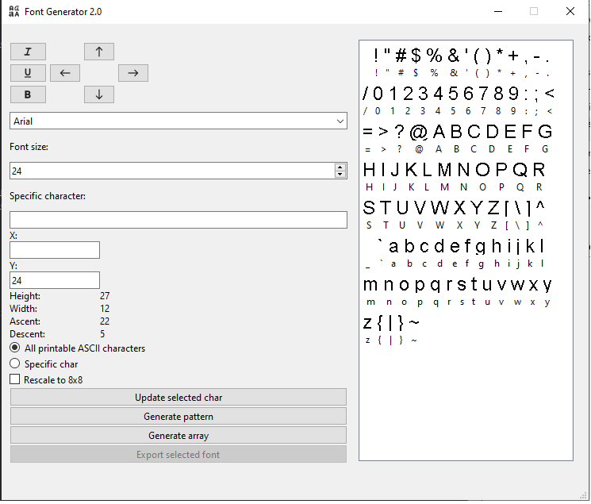
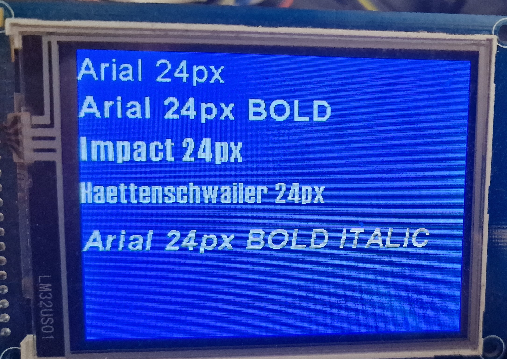

# Font Generator 2.0

Application for generation fonts for TFT and OLED Displays (generating fonts for LED Matrix displays is under development)

Bellow is example code of how to render font on your display - in this example, I used display based od SSD1289 controller: 

```cpp
t_font_spec ssd1289_put_char_buffered(uint16_t *buff, uint16_t buff_width, uint8_t c, int x, uint16_t color, uint16_t back_color) {
    if (c < 32 || c > 126) return {0, 0, 0};

    t_font_spec spec = current_font.font_spec_array[c - 32];

    uint32_t offset = 0;
    for (uint8_t i = 0; i < (c - 32); i++) {
        uint16_t width = current_font.font_spec_array[i].width_in_bits;
        uint16_t height = current_font.height;
        offset += ((width + 7) / 8) * height;
    }

    const uint8_t *font_template = current_font.font_array + offset;
    uint8_t row;
    for (row = 0; row < current_font.height; row++) {
        for (uint8_t col = 0; col < spec.width_in_pixel; col++) {
            uint16_t byte_char_idx = row * ((spec.width_in_pixel + 7) / 8) + (col / 8);
            uint8_t byte_char = font_template[byte_char_idx];
            uint16_t line_buff_index = row * buff_width + (x + col);
            uint8_t mask = 0x80 >> (col % 8);
            if (byte_char & mask)
                buff[line_buff_index] = color;
            else buff[line_buff_index] = back_color;
        }
    }
    return spec;
}
```







 
